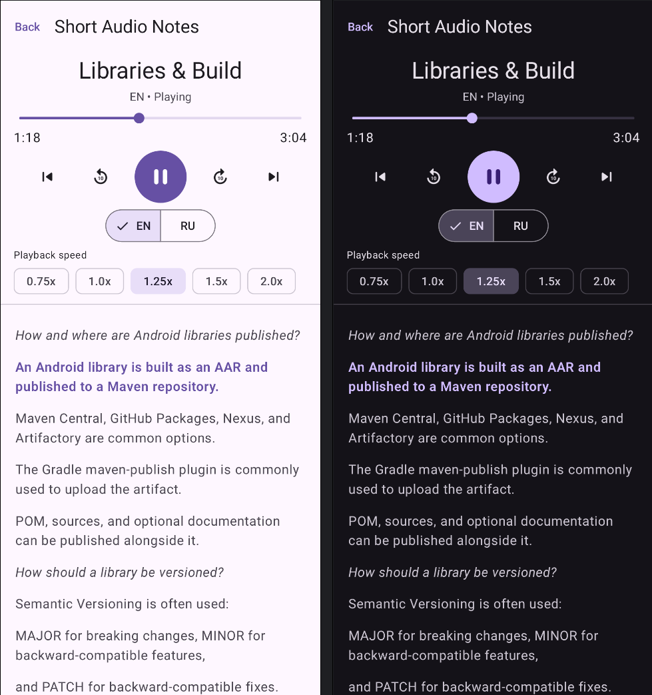

# Android Handbook Audio 🎧

Android Handbook Audio is a native Android companion app for [Android Dev Handbook](https://khodorkin-dmitrii.github.io/android-dev-handbook/en/). It is designed to stream educational audio playlists published through the Handbook's GitHub Pages manifests.

The first content source is **Short Audio Notes**: concise topics covering Android, Kotlin, Computer Science, Coroutines, Architecture, Networking, Testing, and related areas in English and Russian.

<table>
  <tr>
    <td valign="top" width="40%">
      <h2>✨ Goals</h2>
      <ul>
        <li>Browse remote playlists and tracks.</li>
        <li>Stream audio directly from the Handbook.</li>
        <li>Support English and Russian content.</li>
        <li>Provide background playback and media controls.</li>
        <li>Provide synchronized transcripts with active cue highlighting and tap-to-seek.</li>
      </ul>
      <h2>🛠 Tech stack</h2>
      <ul>
        <li>Kotlin</li>
        <li>Jetpack Compose + Material 3</li>
        <li>AndroidX Navigation 3</li>
        <li>MVVM + StateFlow</li>
        <li>Hilt</li>
        <li>Retrofit / OkHttp / Kotlin Serialization</li>
        <li>AndroidX Media3</li>
        <li>DataStore</li>
      </ul>
    </td>
    <td valign="top" width="60%">
      <h2>📱 Player</h2>
      
    </td>
  </tr>
</table>

## 🌐 Data source

Android Dev Handbook GitHub Pages acts as the app's static backend. The public catalog is available at:

https://khodorkin-dmitrii.github.io/android-dev-handbook/assets/audio/catalog.json

## 🗺 Roadmap

- [x] Project foundation
- [x] Remote catalog and playlist loading
- [x] Playlist screen
- [x] Track list
- [x] Streaming playback
- [x] Full player screen
- [x] Background playback / MediaSession
- [x] Playback polish and persistence
- [x] Language switching and preferred language
- [x] Cue-aligned position transfer between language renditions
- [ ] Static transcripts
- [x] Timed synchronized SRT transcripts
- [x] Inline SRT formatting (`italic`, `bold`, `underline`)
- [ ] UI/UX polish: visual hierarchy, icon-based controls, spacing, and interaction feedback
- [ ] UI/UX accessibility and adaptive layouts for different screen sizes
- [ ] Content improvements: expand playlists, review translations, audio quality, and transcript parity
- [ ] Offline/caching experiments

## 🔗 Related

- [Android Dev Handbook](https://khodorkin-dmitrii.github.io/android-dev-handbook/en/)
